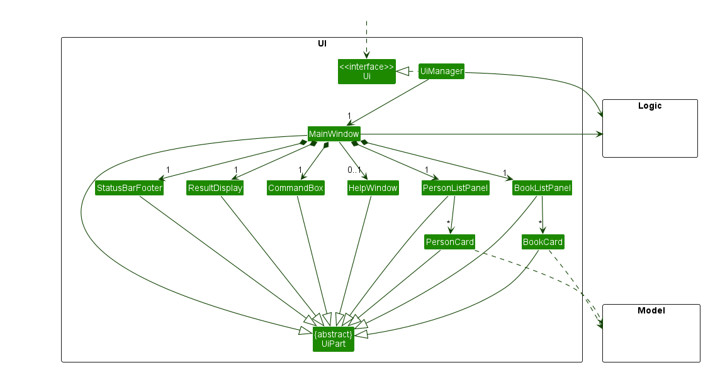
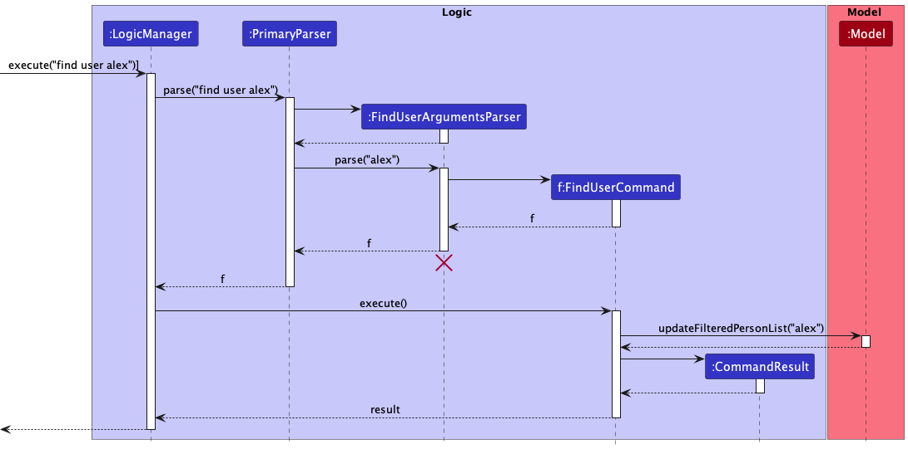
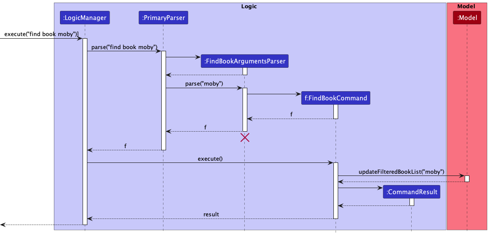
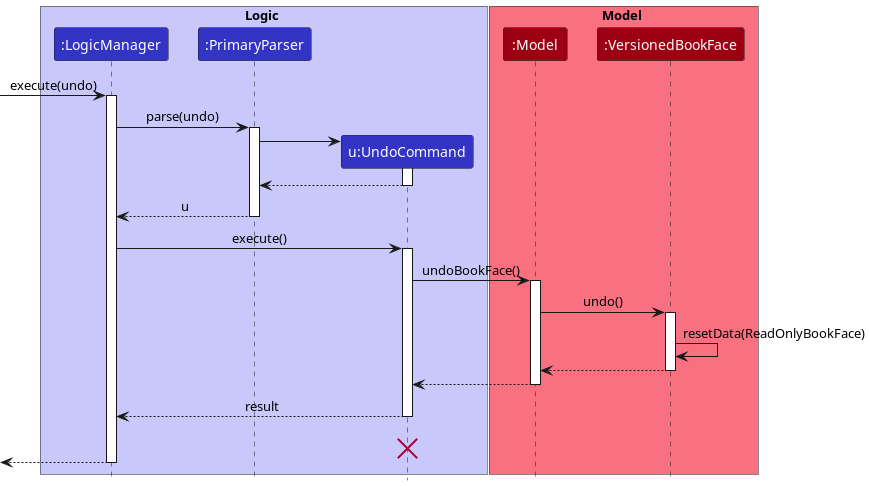

# Developer Guide
* Table of Contents {:toc}
- [Acknowledgements](#acknowledgements)
- [Setting up, getting started](#setting-up-getting-started)
- [Design](#design)
  - [Architecture](#architecture)
  - [UI component](#ui-component)
  - [Logic component](#logic-component)
  - [Model component](#model-component)
  - [Storage component](#storage-component)
  - [Common classes](#common-classes)
- [Implementation](#implementation)
  - [[Proposed] Add](#proposed-add)
  - [[Proposed] Delete](#proposed-delete)
  - [[Proposed] List](#proposed-list)
  - [[Proposed] Find](#proposed-find)
  - [[Proposed] Loan](#proposed-loan)
  - [[Proposed] Return](#proposed-return)
- [Documentation, logging, testing, configuration](#documentation-logging-testing-configuration-dev-ops)
- [Appendix: Requirements](#appendix-requirements)
  - [Product scope](#product-scope)
  - [User stories](#user-stories)
  - [Use cases](#use-cases)
  - [Non-function Requirements](#non-functional-requirements)
  - [Glossary](#glossary)
- [Appendix: Instructions for manual testing](#appendix-instructions-for-manual-testing)

--------------------------------------------------------------------------------------------------------------------

## **Acknowledgements**

* {list here sources of all reused/adapted ideas, code, documentation, and third-party libraries -- include links to the original source as well}

--------------------------------------------------------------------------------------------------------------------

## **Setting up, getting started**

Refer to the guide [_Setting up and getting started_](SettingUp.md).

--------------------------------------------------------------------------------------------------------------------

## **Design**

:bulb: **Tip:** The `.puml` files used to create diagrams in this document can be found in the [diagrams](https://github.com/AY2223S1-CS2103-F14-4/tp/tree/master/docs/diagrams/) folder. Refer to the [_PlantUML Tutorial_ at se-edu/guides](https://se-education.org/guides/tutorials/plantUml.html) to learn how to create and edit diagrams.

### Architecture

The ***Architecture Diagram*** given above explains the high-level design of the App.

Given below is a quick overview of main components and how they interact with each other.

**Main components of the architecture**

**`Main`** has two classes called [`Main`](https://github.
com/AY2223S1-CS2103-F14-4/tp/blob/master/src/main/java/bookface/Main.java) and [`MainApp`](https://github.
com/AY2223S1-CS2103-F14-4/tp/blob/master/src/main/java/bookface/MainApp.java). It is responsible for,
* At app launch: Initializes the components in the correct sequence, and connects them up with each other.
* At shut down: Shuts down the components and invokes cleanup methods where necessary.

[**`Commons`**](#common-classes) represents a collection of classes used by multiple other components.

The rest of the App consists of four components.

* [**`UI`**](#ui-component): The UI of the App.
* [**`Logic`**](#logic-component): The command executor.
* [**`Model`**](#model-component): Holds the data of the App in memory.
* [**`Storage`**](#storage-component): Reads data from, and writes data to, the hard disk.

**How the architecture components interact with each other**

The *Sequence Diagram* below shows how the components interact with each other for the scenario where the user issues the command `delete 1`.

Each of the four main components (also shown in the diagram above),

* defines its *API* in an `interface` with the same name as the Component.
* implements its functionality using a concrete `{Component Name}Manager` class (which follows the corresponding API `interface` mentioned in the previous point.

For example, the `Logic` component defines its API in the `Logic.java` interface and implements its functionality using the `LogicManager.java` class which follows the `Logic` interface. Other components interact with a given component through its interface rather than the concrete class (reason: to prevent outside component's being coupled to the implementation of a component), as illustrated in the (partial) class diagram below.

The sections below give more details of each component.

### UI component

The **API** of this component is specified in [`Ui.java`](https://github.com/AY2223S1-CS2103-F14-4/tp/blob/master/src/main/java/bookface/ui/Ui.java)

The UI consists of a `MainWindow` that is made up of parts e.g.`CommandBox`, `ResultDisplay`, `PersonListPanel`, `StatusBarFooter` etc. All these, including the `MainWindow`, inherit from the abstract `UiPart` class which captures the commonalities between classes that represent parts of the visible GUI.

The `UI` component uses the JavaFx UI framework. The layout of these UI parts are defined in matching `.fxml` files 
that are in the `src/main/resources/view` folder. For example, the layout of the [`MainWindow`](https://github.com/AY2223S1-CS2103-F14-4/tp/blob/master/src/main/java/bookface/ui/MainWindow.java) is specified in [`MainWindow.fxml`](https://github.com/AY2223S1-CS2103-F14-4/tp/blob/master/src/main/resources/view/MainWindow.fxml)

The `UI` component,

* executes user commands using the `Logic` component.
* listens for changes to `Model` data so that the UI can be updated with the modified data.
* keeps a reference to the `Logic` component, because the `UI` relies on the `Logic` to execute commands.
* depends on some classes in the `Model` component, as it displays `Person` object residing in the `Model`.

### Logic component

**API** : [`Logic.java`](https://github.com/AY2223S1-CS2103-F14-4/tp/blob/master/src/main/java/bookface/logic/Logic.java)

Here's a (partial) class diagram of the `Logic` component:

How the `Logic` component works:
1. When `Logic` is called upon to execute a command, it uses the `BookFaceParser` class to parse the user command.
1. This results in a `Command` object (more precisely, an object of one of its subclasses e.g., `AddCommand`) which is executed by the `LogicManager`.
1. The command can communicate with the `Model` when it is executed (e.g. to add a person).
1. The result of the command execution is encapsulated as a `CommandResult` object which is returned back from `Logic`.

The Sequence Diagram below illustrates the interactions within the `Logic` component for the `execute("delete 1")` API call.

:information_source: **Note:** The lifeline for `DeleteCommandParser` should end at the destroy marker (X) but due to a limitation of PlantUML, the lifeline reaches the end of diagram.

Here are the other classes in `Logic` (omitted from the class diagram above) that are used for parsing a user command:

How the parsing works:
* When called upon to parse a user command, the `BookFaceParser` class creates an `XYZCommandParser` (`XYZ` is a placeholder for the specific command name e.g., `AddCommandParser`) which uses the other classes shown above to parse the user command and create a `XYZCommand` object (e.g., `AddCommand`) which the `BookFaceParser` returns back as a `Command` object.
* All `XYZCommandParser` classes (e.g., `AddCommandParser`, `DeleteCommandParser`, ...) inherit from the `Parser` interface so that they can be treated similarly where possible e.g, during testing.

### Model component
**API** : [`Model.java`](https://github.com/AY2223S1-CS2103-F14-4/tp/blob/master/src/main/java/bookface/model/Model.java)

The `Model` component,

* stores BookFace data i.e., all `Person` objects (which are contained in a `UniquePersonList` object).
* stores the currently 'selected' `Person` objects (e.g., results of a search query) as a separate _filtered_ list which is exposed to outsiders as an unmodifiable `ObservableList<Person>` that can be 'observed' e.g. the UI can be bound to this list so that the UI automatically updates when the data in the list change.
* stores a `UserPref` object that represents the user’s preferences. This is exposed to the outside as a `ReadOnlyUserPref` objects.
* does not depend on any of the other three components (as the `Model` represents data entities of the domain, they should make sense on their own without depending on other components)

:information_source: **Note:** An alternative (arguably, a more OOP) model is given below. It has a `Tag` list in the `BookFace`, which `Person` references. This allows `BookFace` to only require one `Tag` object per unique tag, instead of each `Person` needing their own `Tag` objects. 

### Storage component

**API** : [`Storage.java`](https://github.com/AY2223S1-CS2103-F14-4/tp/blob/master/src/main/java/bookface/storage/Storage.java)

The `Storage` component,
* can save both BookFace data and user preference data in json format, and read them back into corresponding objects.
* inherits from both `BookFaceStorage` and `UserPrefStorage`, which means it can be treated as either one (if only the functionality of only one is needed).
* depends on some classes in the `Model` component (because the `Storage` component's job is to save/retrieve objects that belong to the `Model`)

### Common classes

Classes used by multiple components are in the `bookface.commons` package.

--------------------------------------------------------------------------------------------------------------------

## **Implementation**

This section describes some noteworthy details on how certain features are implemented.

### [Proposed] Add

### [Proposed] Delete

### [Proposed] List

### Find
#### Implementation

The find feature is faciliated by `FindUserCommand` and `FindUserArgumentsParser` for finding users, and `FindBookCommand` and `FindBookArgumentsParser` for finding books. 
It implements the following operations:
* `#updateFilteredPersonList(predicate)` — Display users with names matching predicate.
* `updatedFilteredBookList(predicate)` — Display books with title/authors matching predicate.

Given below is an example usage scenario and how the find users mechanism behaves at each step.

Step 1. Assume that BookFace contains some users that are added through several `AddUserCommand` executed by the user. The user executes `find user alex` command to find any user with name 'alex' within the address book. 

Step 2. `LogicManager` executes the `find user alex` command.

Step 3. PrimaryParser then creates a new `FindUserArgumentsParser` after parsing `find user alex`.

Step 4. `FindUserArgumentsParser` parses `"alex"` and creates a new `FindUserCommand`.

Step 5. `LogicManager` executes the `FindUserCommand`.

Step 6. `FindUserCommand` calls `Model#updateFilteredPersonList("alex")`  and find all users with names matching "alex".

Step 7. `FindUserCommand` creates new `CommandResult` and returns the result to `LogicManager`.

The following sequence diagram shows a visualization of the above find process:

The following activity diagram summarizes what happens when the librarian executes a find user command:

The process for finding books goes through a similar process as the process for finding users. Given below is an example usage scenario and how the find books mechanism behaves at each step.

Step 1. Assume that BookFace contains some books that are added through several `AddBookCommand` executed by the user. The user executes `find book moby` command to find any book with title or author with 'moby' within the book list. 

Step 2. `LogicManager` executes the `find book moby` command.

Step 3. PrimaryParser then creates a new `FindBookArgumentsParser` after parsing `find book moby`.

Step 4. `FindBookArgumentsParser` parses `"moby"` and creates a new `FindBookCommand`.

Step 5. `LogicManager` executes the `FindBookCommand`.

Step 6. `FindBookCommand` calls `Model#updateFilteredBookList("moby")`  and find all books with titles or authors matching "moby".

Step 7. `FindBookCommand` creates new `CommandResult` and returns the result to `LogicManager`.

The following sequence diagram shows a visualization of the above find process:

The following activity diagram summarizes what happens when the librarian executes a find command:

#### Design considerations
The find command is designed such that the matches within `BookList` and `UniquePersonList` are easily found and listed onto the UI of BookFace. 

--------------------------------------------------------------------------------------------------------------------

### [Proposed] Loan

### [Proposed] Return

### \[Proposed\] Undo/redo feature

#### Proposed Implementation

The proposed undo/redo mechanism is facilitated by `VersionedBookFace`. It extends `BookFace` with an undo/redo history, stored internally as an `bookFaceStateList` and `currentStatePointer`. Additionally, it implements the following operations:

* `VersionedBookFace#commit()` — Saves the current BookFace state in its history.
* `VersionedBookFace#undo()` — Restores the previous BookFace state from its history.
* `VersionedBookFace#redo()` — Restores a previously undone BookFace state from its history.

These operations are exposed in the `Model` interface as `Model#commitBookFace()`, `Model#undoBookFace()` and `Model#redoBookFace()` respectively.

Given below is an example usage scenario and how the undo/redo mechanism behaves at each step.

Step 1. The user launches the application for the first time. The `VersionedBookFace` will be initialized with the initial BookFace state, and the `currentStatePointer` pointing to that single BookFace state.

Step 2. The user executes `delete 5` command to delete the 5th person in BookFace. The `delete` command calls `Model#commitBookFace()`, causing the modified state of BookFace after the `delete 5` command executes to be saved in the `bookFaceStateList`, and the `currentStatePointer` is shifted to the newly inserted BookFace state.

Step 3. The user executes `add n/David …​` to add a new person. The `add` command also calls `Model#commitBookFace()`, causing another modified BookFace state to be saved into the `bookFaceStateList`.

:information_source: **Note:** If a command fails its execution, it will not call `Model#commitBookFace()`, so BookFace state will not be saved into the `bookFaceStateList`.

Step 4. The user now decides that adding the person was a mistake, and decides to undo that action by executing the `undo` command. The `undo` command will call `Model#undoBookFace()`, which will shift the `currentStatePointer` once to the left, pointing it to the previous BookFace state, and restores BookFace to that state.

:information_source: **Note:** If the `currentStatePointer` is at index 0, pointing to the initial BookFace state, then there are no previous BookFace states to restore. The `undo` command uses `Model#canUndoBookFace()` to check if this is the case. If so, it will return an error to the user rather
than attempting to perform the undo.

The following sequence diagram shows how the undo operation works:

:information_source: **Note:** The lifeline for `UndoCommand` should end at the destroy marker (X) but due to a limitation of PlantUML, the lifeline reaches the end of diagram.

The `redo` command does the opposite — it calls `Model#redoBookFace()`, which shifts the `currentStatePointer` once to the right, pointing to the previously undone state, and restores BookFace to that state.

:information_source: **Note:** If the `currentStatePointer` is at index `bookFaceStateList.size() - 1`, pointing to the latest BookFace state, then there are no undone BookFace states to restore. The `redo` command uses `Model#canRedoBookFace()` to check if this is the case. If so, it will return an error to the user rather than attempting to perform the redo.

Step 5. The user then decides to execute the command `list`. Commands that do not modify BookFace, such as `list`, will usually not call `Model#commitBookFace()`, `Model#undoBookFace()` or `Model#redoBookFace()`. Thus, the `bookFaceStateList` remains unchanged.

Step 6. The user executes `clear`, which calls `Model#commitBookFace()`. Since the `currentStatePointer` is not pointing at the end of the `bookFaceStateList`, all BookFace states after the `currentStatePointer` will be purged. Reason: It no longer makes sense to redo the `add n/David …​` command. This is the behavior that most modern desktop applications follow.

The following activity diagram summarizes what happens when a user executes a new command:

#### Design considerations:

**Aspect: How undo & redo executes:**

* **Alternative 1 (current choice):** Saves the entire BookFace.
  * Pros: Easy to implement.
  * Cons: May have performance issues in terms of memory usage.

* **Alternative 2:** Individual command knows how to undo/redo by
  itself.
  * Pros: Will use less memory (e.g. for `delete`, just save the person being deleted).
  * Cons: We must ensure that the implementation of each individual command are correct.

_{more aspects and alternatives to be added}_

### \[Proposed\] Data archiving

_{Explain here how the data archiving feature will be implemented}_

--------------------------------------------------------------------------------------------------------------------

## **Documentation, logging, testing, configuration, dev-ops**

* [Documentation guide](Documentation.md)
* [Testing guide](Testing.md)
* [Logging guide](Logging.md)
* [Configuration guide](Configuration.md)
* [DevOps guide](DevOps.md)

--------------------------------------------------------------------------------------------------------------------

## **Appendix: Requirements**

### Product scope

**Target user profile**:

* librarians managing a small library
* has a need to manage a significant number of patrons
* prefer desktop apps over other types
* can type fast and is reasonably comfortable using CLI apps
* has no access to card-based systems to manage loans

**Value proposition**: Our app replaces a paper-based system or manual tracking of books, providing greater speed/efficiency in identifying where a book is, or when it is due. It also adds a member-tracking system to handle an increasing number of library members.

### User stories

Priorities: High (must have) - `* * *`, Medium (nice to have) - `* *`, Low (unlikely to have) - `*`

| Priority | As a …​                            | I want to …​                   | So that I can…​                                        |
|----------|------------------------------------|--------------------------------|--------------------------------------------------------|
| `* * *`  | new user                           | see usage instructions         | refer to instructions when I forget how to use the App |
| `* * *`  | user                               | add book records               |                                                        |
| `* * *`  | user                               | delete book records            |                                                        |
| `* * *`  | user                               | view the book records          |                                                        |
| `* * *`  | user                               | add new patrons to my library  |                                                        |
| `* * *`  | user                               | delete patrons from my library |                                                        |
| `* * *`  | user                               | add loans                      | mark books as unavailable                              |
| `* * *`  | user                               | mark loans as returned         | mark books as available                                |
| `* * *`  | person who likes to talk to others | type my commands to a CLI      | so I can work while interacting with my patrons        |

*{More to be added}*

### Use cases

(For all use cases below, the **System** is the `BookFace` and the **Actor** is the `User`, unless specified otherwise)

**Use case: UC01 - Delete a book record**

**MSS**

1.  User requests to delete a book record
2.  BookFace shows a list of books
3.  User requests to delete a specific book record in the list
4.  BookFace deletes the book record from the list

Use case ends.

**Extensions**

* 2a. The list is empty.

  Use case ends.

* 3a. The given index is invalid.

    * 3a1. BookFace shows an error message.

      Use case resumes at step 2.

**Use case: UC02 - List book records**

**MSS:**

1.  User requests to list all book records
2.  BookFace shows a list of books
 Use case ends.

**Extensions:**

* 1a. The list is empty.
   Use case ends.

* 1b. The list of books cannot be retrieved.
    * 1b1. BookFace shows an error message.
     Use case ends.

**Use case: UC03 - Add a book**

**MSS**
1. The librarian has a new book to add to BookFace.
2. The librarian uses the `add book` command with the required fields.
3. BookFace checks for the correctness of the command.
4. BookFace adds the entry to the list of books.

    Use case ends.

**Extensions**
* 3a. There is a book with the exact same details.
  * 3a1. BookFace notifies the librarian of the duplicate.
  * 3a2. BookFace creates this book as a separate object.
  * 3a3. BookFace saves this book to the list.

    Use case ends.
* 3b. The librarian did not specify all required fields.
  * 3b1. BookFace notifies the librarian of the correct usage of `add book`.

    Use case ends.

### Non-Functional Requirements

1. Should work on any _mainstream OS_ as long as it has Java `11` or above installed.
2. Should be able to hold up to 1000 persons without a noticeable sluggishness in performance for typical usage.
3. A user with above average typing speed for regular English text (i.e. not code, not system admin commands) should be able to accomplish most of the tasks faster using commands than using the mouse.
4. Someone without coding background should find BookFace easy to use.
5. The system should respond in 1 second.
6. The system should be backward compatible with data produced by earlier versions of the system.
7. BookFace is not required to handle the displaying detailed reports about users (their loan history, statistics on
   their membership such as frequency of loans) yet.
8. BookFace should work even without an active internet connection.
9. The data stored in a BookFace instance should be recoverable even if the instance crashes.
10. BookFace will need at least 50 MB of disk space to work.
11. BookFace does not plan to improve its accessibility for blind, deaf, or otherwise disabled users according to
    the Web Content Accessibility Guidelines (WCAG 2.1)
12. BookFace should be able to handle basic human mistakes, such as incorrect syntax for commands and prompt the
    user to retry
13. BookFace should be extensible and sufficiently decoupled such that a separate GUI can be attached to the
    existing backend services and database

### Glossary

<table>
<colgroup>
<col width="30%" />
<col width="70%" />
</colgroup>
<thead>
<tr class="header">
<th>Term</th>
<th>Explanation</th>
</tr>
</thead>
<tbody>
<tr>
<td markdown="span">Mainstream OS</td>
<td markdown="span">Windows, Linux, OS-X</td>
</tr>
<tr>
<td markdown="span">CLI</td>
<td markdown="span">Command-Line Interface</td>
</tr>
<tr>
<td markdown="span">GUI</td>
<td markdown="span">Graphical User Interface</td>
</tr>
<tr>
<td markdown="span">Loan</td>
<td markdown="span">A book that has been borrowed from the library</td>
</tr>
</tbody>
</table>

--------------------------------------------------------------------------------------------------------------------

## **Appendix: Instructions for manual testing**

Given below are instructions to test the app manually.

:information_source: **Note:** These instructions only provide a starting point for testers to work on;
testers are expected to do more *exploratory* testing.

### Launch and shutdown

1. Initial launch

   1. Download the jar file and copy into an empty folder

   1. Double-click the jar file Expected: Shows the GUI with a set of sample contacts. The window size may not be optimum.

1. Saving window preferences

   1. Resize the window to an optimum size. Move the window to a different location. Close the window.

   1. Re-launch the app by double-clicking the jar file. 
       Expected: The most recent window size and location is retained.

1. _{ more test cases …​ }_

### Deleting a person

1. Deleting a person while all persons are being shown

   1. Prerequisites: List all persons using the `list` command. Multiple persons in the list.

   1. Test case: `delete 1` 
      Expected: First contact is deleted from the list. Details of the deleted contact shown in the status message. Timestamp in the status bar is updated.

   1. Test case: `delete 0` 
      Expected: No person is deleted. Error details shown in the status message. Status bar remains the same.

   1. Other incorrect delete commands to try: `delete`, `delete x`, `...` (where x is larger than the list size) 
      Expected: Similar to previous.

1. _{ more test cases …​ }_

### Saving data

1. Dealing with missing/corrupted data files

   1. _{explain how to simulate a missing/corrupted file, and the expected behavior}_

1. _{ more test cases …​ }_
